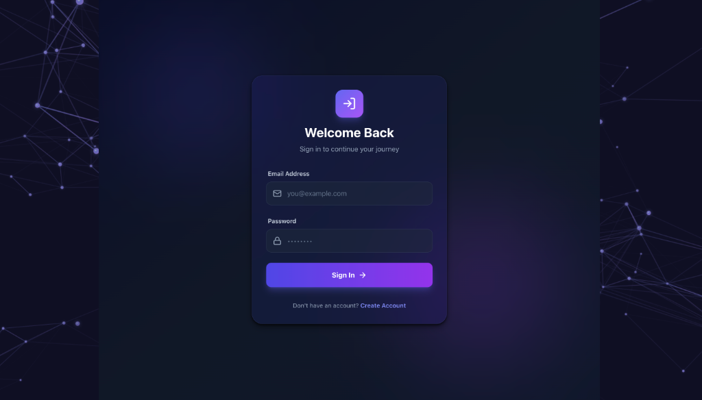
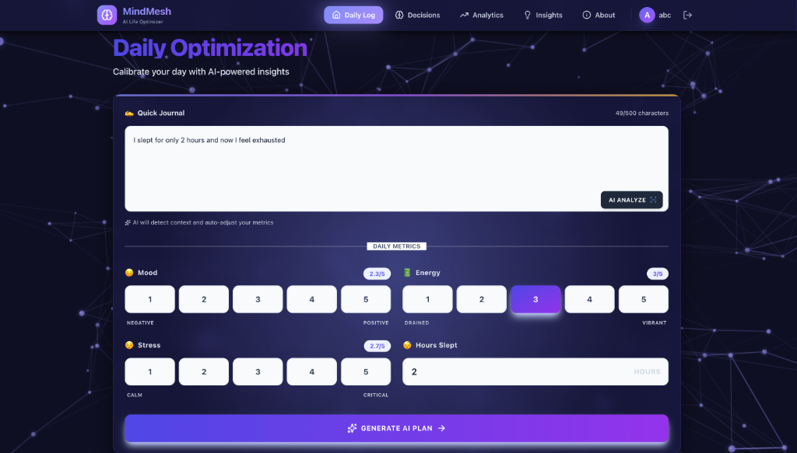
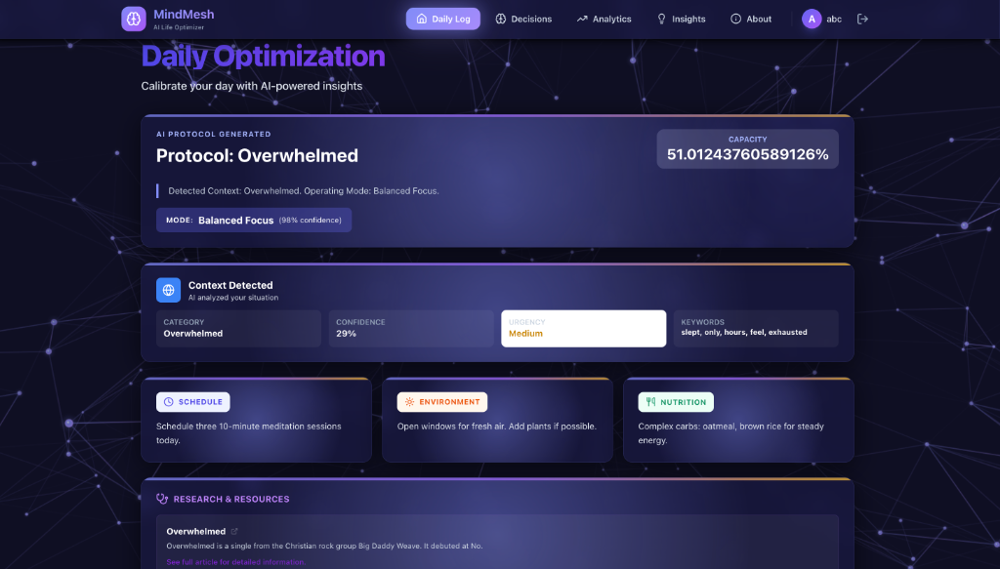
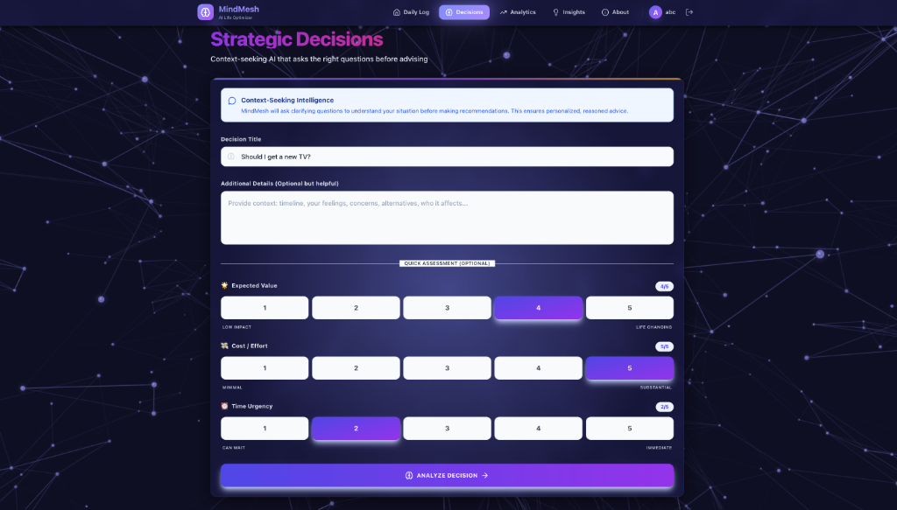
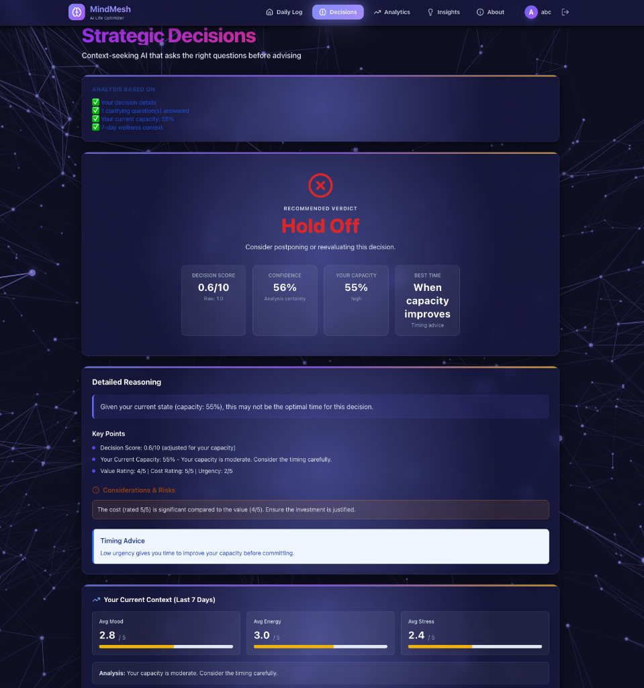
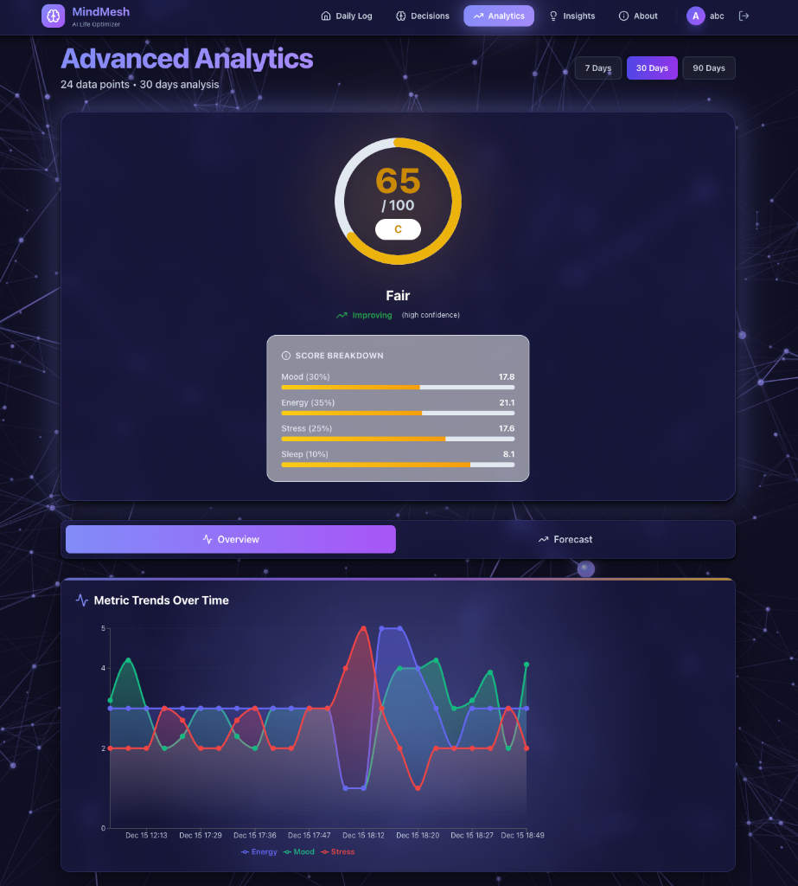
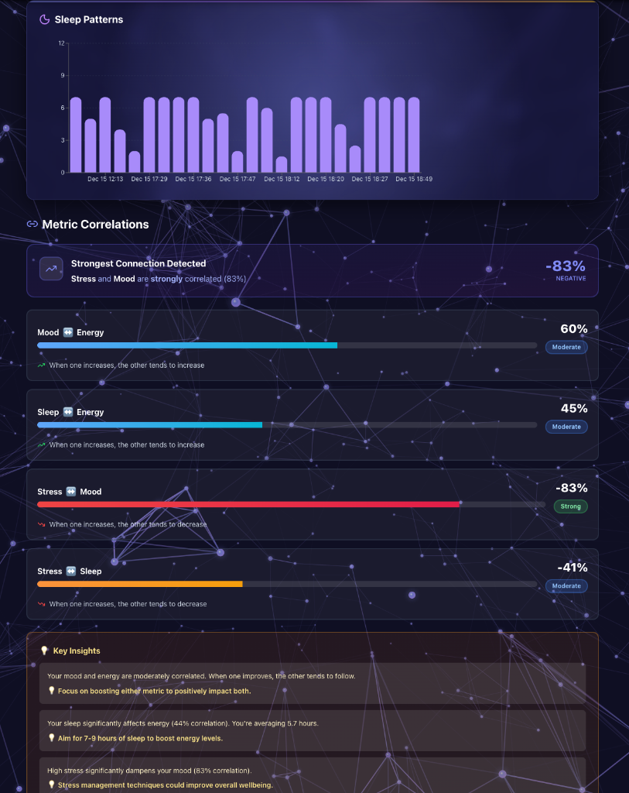
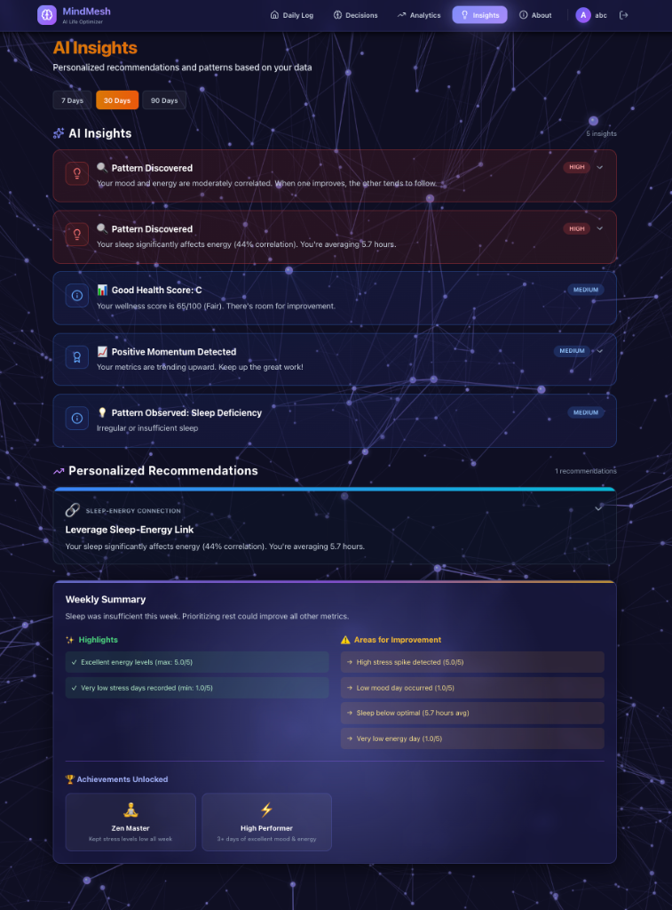
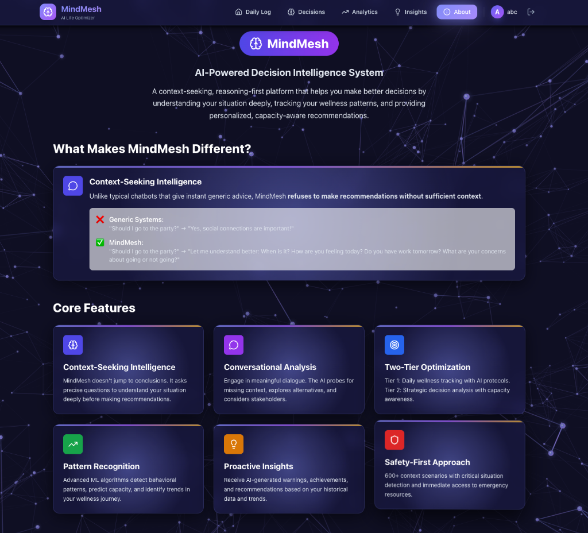
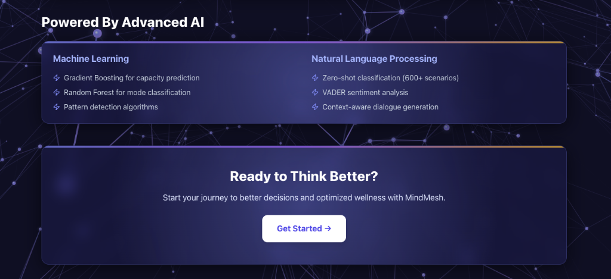

# MindMesh 🧠

**AI-Powered Life Optimizer & Decision Support System**

MindMesh is an intelligent personal wellness and decision-making platform that combines daily journaling, ML-driven insights, and AI-powered guidance to help you optimize your life decisions based on your mental, physical, and emotional patterns.

---

## ✨ Features

### 🏠 Smart Daily Journaling
- **Mood & Energy Tracking**: Log your daily mood, energy levels, stress, and sleep quality
- **AI Context Detection**: Automatically identifies patterns in your entries
- **Personalized Recommendations**: Get tailored suggestions based on your current state
- **Web Research Integration**: Receive relevant articles and resources

### 🎯 AI Decision Analysis
- **Advanced Decision Support**: Analyze important life decisions with AI assistance
- **Multi-Factor Analysis**: Considers your historical data, current state, and decision context
- **Opportunity & Risk Assessment**: Identifies potential opportunities and risks
- **Confidence Scoring**: Get AI confidence levels for decision recommendations
- **Detailed Reasoning**: Understand the "why" behind each recommendation

### 📊 Advanced Analytics
- **Interactive Charts**: Visualize your mood, energy, stress, and sleep patterns over time
- **7-Day Forecasting**: ML-powered predictions of your future states
- **Anomaly Detection**: Automatically identifies unusual patterns in your data
- **Cycle Recognition**: Discovers recurring patterns in your wellness metrics
- **Correlation Analysis**: Understand how different metrics relate to each other
- **AI Insights**: Get personalized insights based on your data trends

### 💡 Personalized Insights
- **Pattern Recognition**: ML algorithms detect meaningful patterns in your data
- **Actionable Recommendations**: Receive specific, personalized guidance
- **Trend Analysis**: Track your progress over time
- **Health Optimization**: Get suggestions to improve your wellbeing

### 🔐 Multi-User Authentication
- **Secure JWT Authentication**: Industry-standard security
- **Personal Data Privacy**: Each user's data is completely isolated
- **Session Management**: Secure login/logout functionality

---

## 🎨 Design Features

### Beautiful Dark Theme UI
- **Glassmorphism Design**: Modern glass-effect cards with backdrop blur
- **Neural Network Background**: Animated 3D plexus mesh visualization
- **Gradient Accents**: Vibrant indigo, purple, and amber color scheme
- **Smooth Animations**: Framer Motion powered interactions
- **Responsive Design**: Works seamlessly on all screen sizes

### Interactive Elements
- **Animated Cards**: Hover effects with 3D transformations
- **Flowing Gradient Borders**: Dynamic color-shifting card borders
- **Smooth Transitions**: Polished UX with attention to detail

---

## 🛠️ Technology Stack

### Frontend
- **React 18**: Modern UI library with hooks
- **Vite**: Lightning-fast build tool and dev server
- **Tailwind CSS**: Utility-first CSS framework
- **Framer Motion**: Smooth animations and transitions
- **Recharts**: Beautiful, responsive charts
- **React Router**: Client-side routing
- **Lucide React**: Beautiful icon system

### Backend
- **Flask**: Python web framework
- **SQLAlchemy**: ORM for database operations
- **PyJWT**: JSON Web Token authentication
- **pandas & NumPy**: Data analysis and manipulation
- **scikit-learn**: Machine learning algorithms

### Database
- **SQLite**: Lightweight, serverless database

---

## 🚀 Installation & Setup

### 1. Clone the Repository

```bash
git clone https://github.com/Anjali-2807/mindmesh.git
cd mindmesh
```

### 2. Backend Setup

```bash
# Navigate to backend directory
cd backend

# Create virtual environment
python -m venv venv

# Activate virtual environment
# On macOS/Linux:
source venv/bin/activate
# On Windows:
venv\Scripts\activate

# Install dependencies
pip install -r requirements.txt

# Create .env file
cp .env.example .env

# Add your Google AI API key to .env
# GOOGLE_API_KEY=your_api_key_here
```

### 3. Frontend Setup

```bash
# Navigate to frontend directory
cd frontend

# Install dependencies
npm install

# Create .env file (if needed)
cp .env.example .env
```

### 4. Initialize Database

```bash
# In the backend directory
python init_db.py
```

---

## 🎯 Running the Application

### Start Backend Server

```bash
# In the backend directory, with venv activated
python app.py
```

The backend server will start on `http://localhost:5000`

### Start Frontend Dev Server

```bash
# In the frontend directory
npm run dev
```

The frontend will start on `http://localhost:5173`

---

## 📱 User Guide

### Getting Started

#### 1. Sign Up
<!-- Screenshot: signup-page.png -->
- Navigate to `http://localhost:5173`
- Click "Sign Up" to create a new account
- Enter your username, email, and password
- Click "Create Account"

#### 2. Login
<!-- Screenshot: login-page.png -->
- Enter your credentials
- Click "Sign In"
- You'll be redirected to your personalized dashboard

### Using the Application

#### Daily Journaling
<!-- Screenshot: home-journal.png -->
1. On the **Home** page, enter how you're feeling in the journal input
2. Rate your mood, energy, stress, and sleep quality (1-10)
3. Click "Analyze & Get Smart Plan"
4. MindMesh will:
   - Detect context from your entry
   - Generate a personalized action plan
   - Provide relevant research and resources
   - Offer support recommendations

#### Making Decisions
<!-- Screenshot: decisions-analysis.png -->
1. Go to the **Decisions** tab
2. Enter your decision question
3. Provide context about the decision
4. Click "Analyze Decision"
5. Review:
   - **AI Verdict**: Clear recommendation
   - **Detailed Reasoning**: Why this recommendation
   - **Opportunities**: Potential benefits
   - **Risks**: Things to watch out for
   - **Contextual Factors**: Your current state analysis

#### Viewing Analytics
<!-- Screenshot: analytics-overview.png -->
1. Navigate to the **Analytics** tab
2. Explore:
   - **Trend Charts**: Visualize your metrics over time
   - **7-Day Forecast**: See predicted future states
   - **Anomalies**: Identify unusual patterns
   - **Cycles**: Discover recurring patterns
   - **Correlations**: Understand metric relationships

#### Exploring Insights
<!-- Screenshot: insights-page.png -->
1. Go to the **Insights** tab
2. View:
   - **Detected Patterns**: ML-identified patterns
   - **AI Insights**: Get personalized observations
   - **Recommendations**: Actionable guidance
   - **Health Score**: Overall wellbeing metric

---

## 🎬 Application Screenshots

### Authentication

#### Signup Page
<!-- Add screenshot of signup page here -->
*Clean, modern signup interface with validation*

#### Login Page

*Secure login with glassmorphism design and neural network background*

### Main Features

#### Home - Daily Journal

*Smart journaling with real-time context detection, mood tracking, and AI-powered plan generation*

#### Generated Plan

*AI-generated personalized action plan with context detection, recommendations for schedule, environment, and nutrition, plus research resources*

#### Decisions - Analysis Input

*Enter your decision with context and rate expected value, cost/effort, and time urgency*

#### Decision Results

*AI verdict with detailed reasoning, decision score, confidence level, capacity analysis, and timing advice based on your current wellness context*

#### Analytics Dashboard

````carousel

*Health score (65/100 Fair) with improving trend (high confidence), score breakdown showing energy (35%), stress (25%), mood (30%), and sleep (10%), plus interactive metric trends chart visualizing energy, mood, and stress over time*
<!-- slide -->

*Sleep patterns bar chart showing daily sleep hours, metric correlations analysis revealing strong negative stress-mood relationship (-83%), moderate mood-energy (60%) and sleep-energy (45%) correlations, and key insights with actionable recommendations*
````

#### 7-Day Forecast
<!-- Add screenshot of forecast section -->
*ML-powered predictions of future wellness states*

#### Anomaly Detection
<!-- Add screenshot of anomalies section -->
*Automatic detection of unusual patterns*

#### Correlation Matrix
<!-- Add screenshot of correlation matrix -->
*Visual representation of metric relationships*

#### Insights Page

*Comprehensive AI insights including pattern discoveries (mood/energy correlation, sleep deficiency), personalized recommendations, weekly summary with highlights and achievements, detected cycles showing weekday vs weekend patterns*

#### About Page

````carousel

*AI-Powered Decision Intelligence System overview showcasing context-seeking intelligence (comparison with generic systems), and core features including conversational analysis, two-tier optimization, pattern recognition, proactive insights, and safety-first approach*
<!-- slide -->

*Complete workflow from daily check-in to strategic decisions, core principles (context over speed, capacity-aware, reasoning over templates, privacy-first), and target users (students, professionals, anyone seeking clarity)*
<!-- slide -->

*Advanced AI capabilities including Machine Learning (gradient boosting, random forest, pattern detection) and Natural Language Processing (zero-shot classification, VADER sentiment, context-aware dialogue generation)*
````

---

## 🗂️ Project Structure

```
mindmesh/
├── backend/
│   ├── app.py                      # Main Flask application
│   ├── requirements.txt            # Python dependencies
│   ├── init_db.py                  # Database initialization
│   ├── models/
│   │   └── database.py             # SQLAlchemy models
│   ├── services/
│   │   ├── ml_predictor.py         # ML forecasting & analysis
│   │   └── ai_service.py           # Google Gemini AI integration
│   └── instance/
│       └── health_tracker.db       # SQLite database
│
├── frontend/
│   ├── src/
│   │   ├── App.jsx                 # Main app component
│   │   ├── index.css               # Global styles
│   │   ├── components/
│   │   │   ├── common/              # Reusable components
│   │   │   ├── analytics/           # Analytics components
│   │   │   ├── home/                # Home page components
│   │   │   └── background/          # 3D neural network
│   │   ├── views/
│   │   │   ├── HomeView.jsx         # Daily journal
│   │   │   ├── DecisionsView.jsx    # Decision analysis
│   │   │   ├── AnalyticsView.jsx    # Data visualization
│   │   │   ├── InsightsView.jsx     # ML insights
│   │   │   ├── LoginView.jsx        # Login page
│   │   │   └── SignupView.jsx       # Signup page
│   │   └── context/
│   │       └── AuthContext.jsx      # Authentication state
│   ├── package.json
│   └── vite.config.js
│
└── README.md
```

---

## 🔑 Key Algorithms & ML Features

### Decision Capacity Analysis
- Analyzes recent wellness data to determine decision-making readiness
- Considers mood, energy, stress, and sleep patterns
- Provides confidence scoring

### Pattern Recognition
- Identifies recurring patterns in user data
- Detects correlations between different metrics
- Recognizes behavioral cycles

### Anomaly Detection
- Statistical analysis to find unusual data points
- Helps identify potential issues early

### Forecasting
- 7-day ahead predictions using historical data
- Linear regression and trend analysis
- Confidence intervals for predictions

### AI-Powered Insights
- Google Gemini AI for natural language understanding
- Context-aware recommendations
- Personalized action planning

---

## 🔒 Security Features

- **JWT Authentication**: Secure token-based authentication
- **Password Hashing**: Werkzeug secure password hashing
- **CORS Protection**: Configured for production security
- **Data Isolation**: Complete user data separation
- **Session Management**: Secure token expiration and refresh

---

## 🌟 Future Enhancements

- [ ] Mobile applications (iOS & Android)
- [ ] Social features (share insights with trusted contacts)
- [ ] Advanced ML models (deep learning for better predictions)
- [ ] Calendar integration
- [ ] Voice journaling

---

## 🤝 Contributing

Contributions are welcome! Please feel free to submit a Pull Request.

1. Fork the repository
2. Create your feature branch (`git checkout -b feature/AmazingFeature`)
3. Commit your changes (`git commit -m 'Add some AmazingFeature'`)
4. Push to the branch (`git push origin feature/AmazingFeature`)
5. Open a Pull Request

